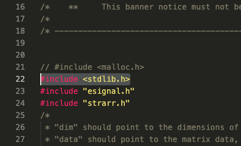
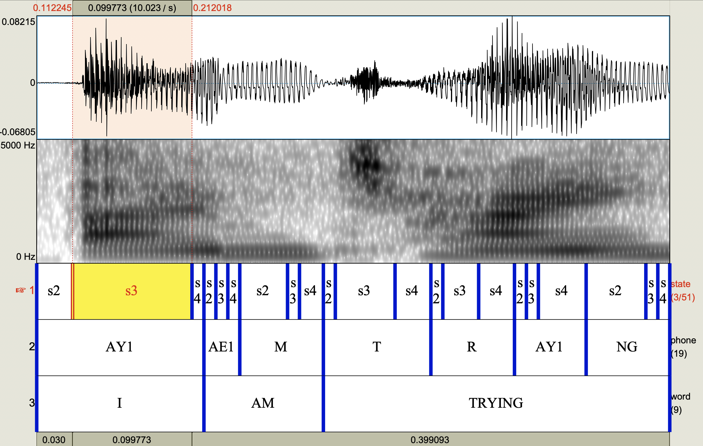

# P2FA for Python3.x

This is a modified version of P2FA for Python3 compatibility.
Everything else remains the same as the original P2FA.
Forced alignment helps to align linguistic units (e.g., phoneme or
words) with the corresponding sound file. All you need is to have a
sound file with a transcription file.
The output will be .TextGrid file with time-aligned phone, word and
optionally state-level tiers.

This was tested on macOS Ventura and Arch Linux.

## 1. Install HTK
First, you need to download HTK source code (http://htk.eng.cam.ac.uk/).
This HTK installation guide is retrieved from
[Link](https://github.com/prosodylab/Prosodylab-Aligner).
(2021-04-13) Installation is based on macOS Sierra.
(2023-05-06) Installation is based on macOS Ventura 13.3.1 (a) - Apple M1 Max

### For 1.1 Arch Linux
I couldn't run HTK-3.4.1 on Arch Linux. I switched to 3.4.0
and everything works fine. Installation of HTK is the same as the one
described below.

Unzip HTK-3.4.1.tar.gz file. I unzipped htk under the current repository so as to keep it in the same directory.

```bash
$ tar -xvf HTK-3.4.1.tar.gz
```

After extracting the tar file, switch to htk directory.

```bash
$ cd htk
```

Compile HTK in the htk directory.

```bash
$ export CPPFLAGS=-UPHNALG
$ ./configure --disable-hlmtools --disable-hslab
$ make clean    # necessary if you're not starting from scratch
$ make all
$ sudo make install # use "sudo" to make htk functions available for all users
```

### 1.2 For Ubuntu 20.04.5 LTS
(Tested as of 2023-05-06)
```bash
# Because I assume 64-bit platform, you may need to install 32-bit headers and libraries first (See: https://stackoverflow.com/a/54082790/7170059)
$ sudo apt-get install gcc-multilib

$ ./configure --disable-hlmtools --disable-hslab
$ make clean    # necessary if you're not starting from scratch
$ make all
$ sudo make install # use "sudo" to make htk functions available for all users

# Quick test if HVite works to confirm that htk functions are installed correctly
$ HVite
```

### 1.3 For macOS
(Tested as of 2023-05-06)
You may need to follow these steps before compiling HTK:

```bash
# Add CPPFLAGS, LIBRARY_PATH
$ export CPPFLAGS=-I/opt/X11/include
$ export LIBRARY_PATH=/opt/X11/lib

# If the above doesn't work, do 
$ ln -s /opt/X11/include/X11 /usr/local/include/X11

# Replace line 21 (#include <malloc.h>) of HTKLib/strarr.c as below
#   include <malloc/malloc.h> 

# Replace line 1650 (labid != splabid) of HTKLib/HRec.c as below
#   labpr != splabid
# This step will prevent "ERROR [+8522] LatFromPaths: Align have dur<=0"
# See: https://speechtechie.wordpress.com/2009/06/12/using-htk-3-4-1-on-mac-os-10-5/

# Compile with options if necessary
$ ./configure 
$ make all
$ sudo make install  # use "sudo" to make htk functions available for all users

# Quick test if HVite works to confirm that htk functions are installed correctly
$ HVite
```

### 1.4 Troubleshooting
* If the "make" command generates errors such as:
    ```
    HGraf.c:73:10: fatal error: 'X11/Xlib.h' file not found
    ```
    * you may need to install XQuartz. Download XQuartz from [this site](https://www.xquartz.org/). You will have `/opt/X11` folder generated with necessary files. You need to manually compile HTKLib with the following command:
    ```bash
    $ cd HTKLib
    # Compile
    $ gcc  -ansi -g -O2 -DNO_AUDIO -D'ARCH="darwin"' -I/usr/include/malloc -Wall -Wno-switch -g -O2 -I. -DPHNALG   -c -o HGraf.o HGraf.c -I /opt/X11/include
    $ cd ..
    # Set the path
    $ export LIBRARY_PATH=/opt/X11/lib
    # Run it again
    $ make all
    $ make install
    (See: http://unixnme.blogspot.com/2018/01/build-htk-on-macos.html)
    ```
* If you encounter `strarr.c:21:10: fatal error: 'malloc.h' file not found`, then comment out `#include <malloc.h>` and add `#include <stdlib.h>` instead as follows.
    (See: https://github.com/JoFrhwld/FAVE/issues/48#issue-602099201)  

* If you see errors like `HTrain.c implicitly declaring library function 'finite'`, replace all `finite` functions in `HTKLib/HTrain.c` with `isfinite`. (See: https://trac.macports.org/ticket/61614)

* Architecture errors like `esignal.c:1184:25: error: use of undeclared identifier 'ARCH'` requires fixing it with the right architecture specifier. Open `HTKLib/esignal.c`and replace lines including `ARCH` as in `(strcmp(architecture, ARCH) == 0)` with `"darwin"` as in `(strcmp(architecture, "darwin") == 0)` (See: https://wstyler.ucsd.edu/posts/p2fa_mac.html)


## 2. Install sox

```bash
$ sudo apt-get install sox

# or in Arch

$ sudo pacman -S sox

# or using brew

$ brew install sox
```

## 3. Run

### stand alone

```bash
$ python align.py examples/ploppy.wav examples/ploppy.txt examples/ploppy.TextGrid
```

### as part of your code

You can invoke the aligner from your code:

```python
from p2fa import align

phoneme_alignments, word_alignments = align.align('WAV_FILE_PATH', 'TRANSCRIPTION_FILE_PATH')

# or 

phoneme_alignments, word_alignments, state_alignments = align.align('WAV_FILE_PATH', 'TRANSCRIPTION_FILE_PATH', state_align=True)
```

## 4. Result


With state-alignments



## TODO
* [x] Updated installation guide
* [ ] Refactor `align.py`

## References
- http://www.ling.upenn.edu/phonetics/p2fa/
- Jiahong Yuan and Mark Liberman. 2008. Speaker identification on the SCOTUS corpus. Proceedings of Acoustics '08.
- https://github.com/prosodylab/Prosodylab-Aligner (P2FA seems better than Prosodylab-Aligner based on my qualitative evaluation)
- English HMM-state level aligner: [Link](https://github.com/jaekookang/p2fa_state_aligner)
- Korean Forced Aligner: [Link](https://github.com/EMCSlabs/Programs/tree/master/Korean_FA) from EMCSLabs.
- Installing p2fa on Mac [Link](https://wstyler.ucsd.edu/posts/p2fa_mac.html)
